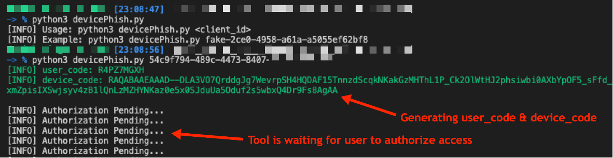
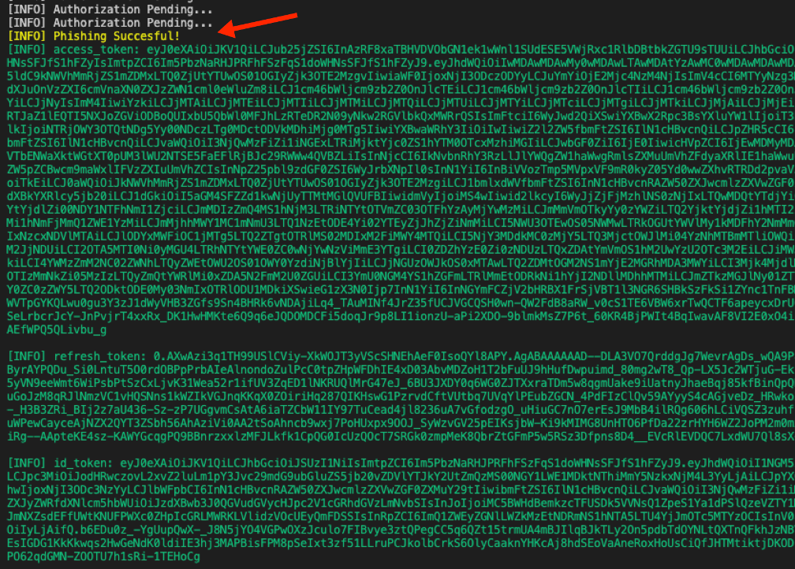
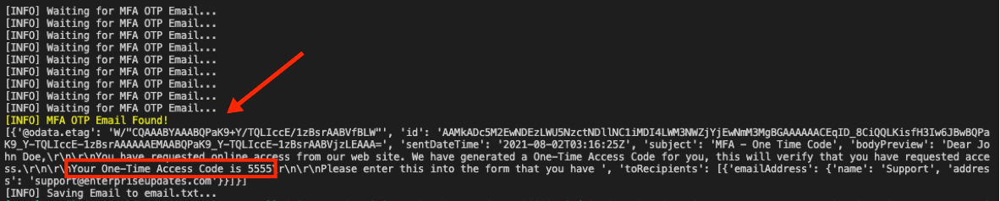
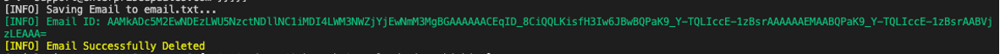

# Microsoft365_devicePhish
Abusing Microsoft 365 OAuth Authorization Flow for Phishing Attack

This is a simple proof-of-concept script that allows an attacker to conduct a phishing attack against Microsoft 365 OAuth Authorization Flow. Using this, one can connect to Microsoft's OAuth API endpoints to create `user_code` and `device_code` and obtain victim user's `access_token` upon successfult phishing attack. Then, the token can be used to access various Office365 products via Microsoft Graph API on behalf of the victim user. In addition, this script was created to help a specific situation where a target organization was utilizaing an Email OTP (One-time Passcode) for their MFA option; thus, with a successful phishing attack, one could read a generated Email OTP code from victim user's email inbox to bypass MFA. 

More details about this phishing attack and scenario can be found on the following [Blog post](https://www.optiv.com/insights/source-zero/blog/microsoft-365-oauth-device-code-flow-and-phishing).

## Usage
```
$ python3 devicePhish.py 
[INFO] Usage: python3 devicePhish.py <client_id>
[INFO] Example: python3 devicePhish.py fake-2ce0-4958-a61a-a5055ef62bf8
```

## Example
1) Generating `user_code` and `device_code` from an Azure App:



2) Upon successfull phishing attack, obtaining `access_token` & `refresh_token` for a victim user:



3) After an Email OTP is triggered, reading the OTP code from the victim's email inbox:



4) After reading the Email OTP code, it deletes the OTP email:




## Credits & References
* [Introducing a new phishing technique for compromising Office 365 accounts](https://o365blog.com/post/phishing/)
* [TokenTactics](https://github.com/rvrsh3ll/TokenTactics)
